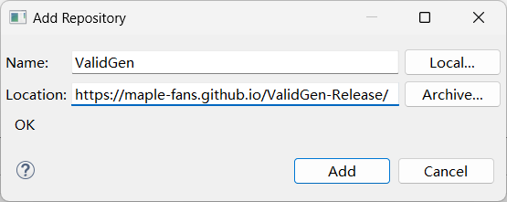
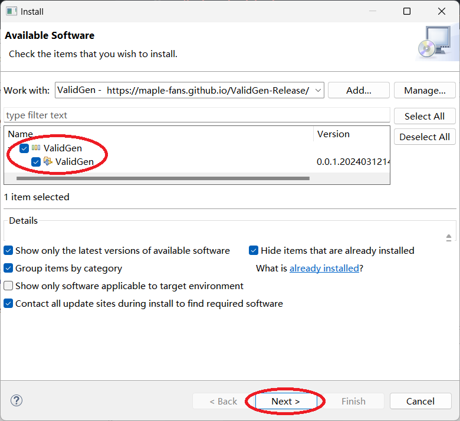
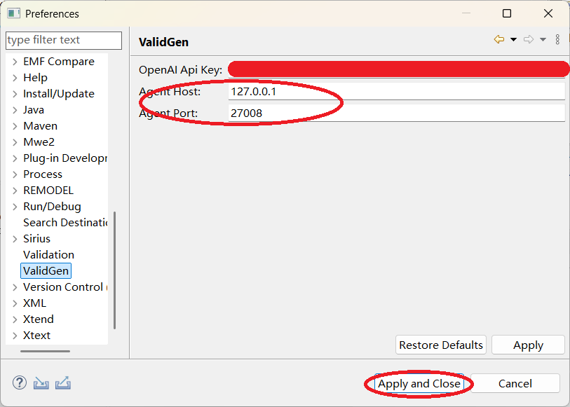

- [Installation](#installation)
- [Import RM2PT Project](#import-rm2pt-project)
- [Generate Process Model](#generate-process-model)
- [Generate Execution Script](#generate-execution-script)
- [Requirement Validation](#requirement-validation)

# Installation

First, Download and install [RM2PT](https://rm2pt.github.io/), [InputGen](https://rm2pt.github.io/advs/inputgen/), and the [agent service](https://github.com/maple-fans/ValidGen-Release/releases/download/ValidGen/ValidGen_Agent.zip), unzip it, and run "ValidGen.exe."

* Click "Help" -> "Install New Software".

* Online Installer
  * Click "Add," input the "Name" (it can be any) and the "Location," then click "Add."
  
  

* Offline Installer
  * Download the package from https://github.com/maple-fans/ValidGen-Release/releases/download/ValidGen/ValidGen.jar

  * Click "Add", input the "Name" (it can be any) and Click "Archive".

  * Select the Package you just downloaded.

   

* Choose "ValidGen" and click "Next".

* Click "Next" -> "Finish".

* Wait for Complete.
* Click "Install anyway" and Restart RM2PT.

* Click "Window" -> "Preferences".

*Input the OPENAI API key and the host and port (use the defaults "127.0.0.1" and "27008"), and then click "Apply and Close."

# Import RM2PT Project

* Click "File" -> "Open Projects from File System".

* Click "Directory" and select the project folder, then click "Finish".

# Generate Process Model

* Right-Click Requirements Model(*.remodel) and Click "RM2PT-Dev" -> "
ValidGen" -> "Generate Process Model".

* Wait for the complete and open diagram automatically.

# Generate Execution Script

* Right-Click Requirements Model(*.remodel) and Click "RM2PT" -> "
OO Prototype" -> "Generate Desktop Prototype".

* Click "Next" -> "Finish".

* Right-Click Requirements Model(*.remodel) and Click "RM2PT-Dev" -> "InputGen".

* Right-Click Requirements Model(*.remodel) and Click "RM2PT-Dev" -> "ValidGen" -> "Generate Validation Script".

* Check the Configuration and Click Finish.

* Wait for complete.

# Requirement Validation
* Right-Click Prototype Project -> "Run As" -> "Maven test".

